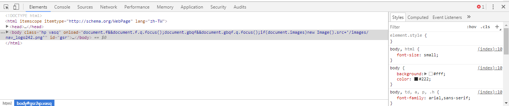
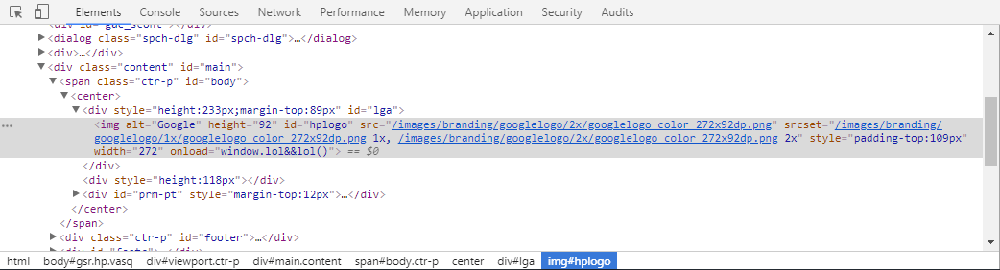
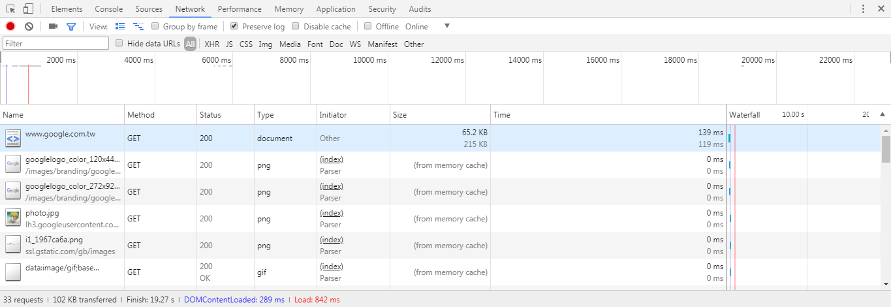
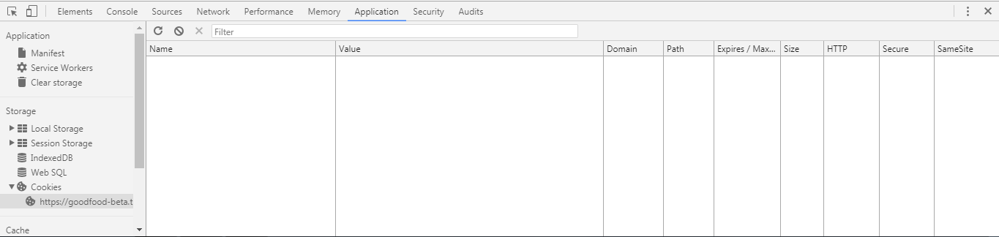
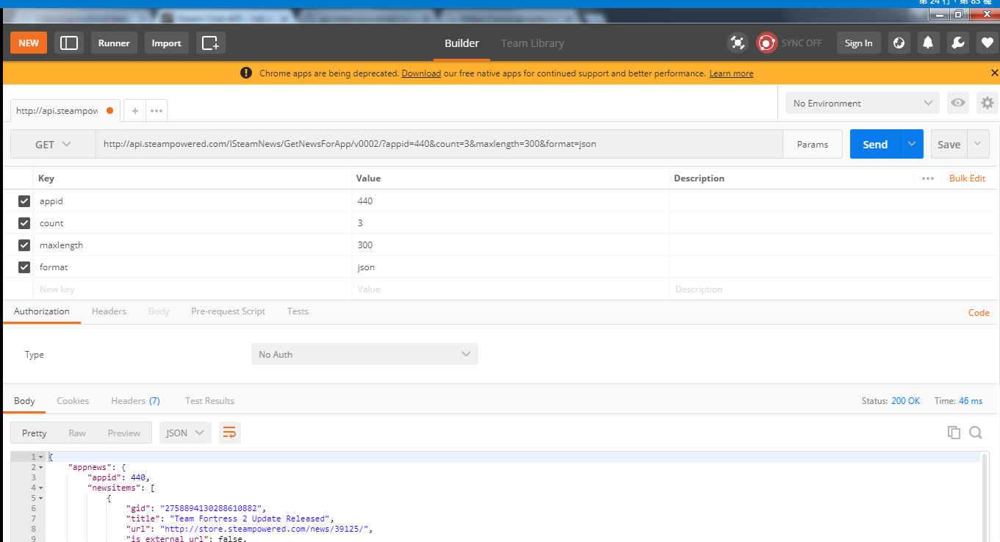

## HTTP 請求以及回應

網頁上的資源是由對目標伺服器發出一個 request ， 之後由對方回傳一個 response 形成 ， 讀取一個網頁時可能會進行大量的 request 與 response。 而我們只要發出相同的 request 就可以取得相同的 response 。  
另外[http請求](https://developer.mozilla.org/zh-TW/docs/Web/HTTP/Methods)有分許多種，不過絕大部分只要知道是POST還是GET方法就好。

## Chrome 開發者工具

**Chrome 開發者工具** 是一個方便的輔助工具 ， 要開啟他只要在 Chrome 瀏覽器中按下 F12 或是點擊右上角的選項 -> 更多工具 -> 開發人員工具 開啟。

開啟後可以預設再在 左/下/右側 看到類似上圖的畫面 ， 爬蟲通常會使用到功能有 Elements標籤 ，Network標籤，Application標籤。
- Elements標籤可以看到與定位目前畫面中的 HTML 標籤。

- Network標籤可以記錄目前網頁所發送的每一個 request 以及它所取得的 response 。
 點擊進去可以觀看詳細訊息，如對方 response 的資料。

而將 Preserve log 選項勾起來後則在改變頁面那之前顯示的 request與response 不會消失。
- Application標籤則只會用到左側中的 Cookies 。

某些網頁用來判斷是否該給予回應的依據就是 Cookies，當抓不到資料的時候可以尋找看看是不是需要特定 Cookies。上圖網站沒有用到 Cookies。

## Postman

[Postman](https://www.getpostman.com/) 是一個非常方便的工具，它可以簡單送出請求並解析回應，
當我們需要測試這個 request 會拿到怎麼樣的 response 時可以利用 Postman 快速的測試。

測試 [Steam Web API](https://developer.valvesoftware.com/wiki/Steam_Web_API) 。

## Robot.txt

某些網站會提供 robot.txt ， 它表示了在這個網域底下的爬蟲規則。例如哪些路徑是允許他人爬蟲，哪些路徑不允許他人爬蟲。當然也可以忽視 robot.txt 想爬就爬。
 google 的 [robot.txt](https://www.google.com.tw/robots.txt)
