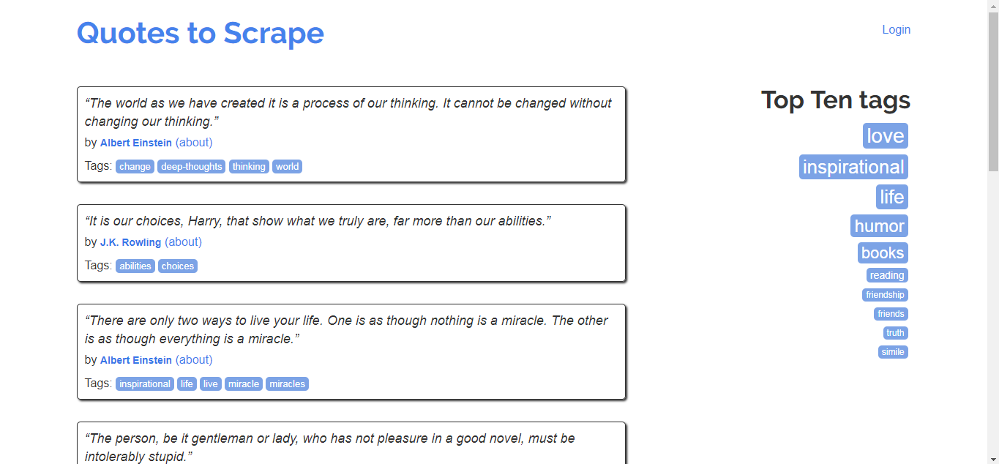

## 網頁元素

[範例頁面](http://quotes.toscrape.com/)
<br>
網頁內容的呈現是由 HTML 語言所組合而成 ， 不同的標籤會呈現不同的內容，而要取得上面範例頁面的內容只要對http://quotes.toscrape.com/ 發出請求即可。



以下為上例頁面的片段 HTML

```html
<div class="col-md-8">
    <div class="quote" itemscope="" itemtype="http://schema.org/CreativeWork">
        <span class="text" itemprop="text">“The world as we have created it is a process of our thinking. It cannot be changed without changing our thinking.”</span>
        <span>by
            <small class="author" itemprop="author">Albert Einstein</small>
            <a href="/author/Albert-Einstein">(about)</a>
        </span>
        <div class="tags">
            Tags:
            <meta class="keywords" itemprop="keywords" content="change,deep-thoughts,thinking,world">
            <a class="tag" href="/tag/change/page/1/">change</a>
            <a class="tag" href="/tag/deep-thoughts/page/1/">deep-thoughts</a>
            <a class="tag" href="/tag/thinking/page/1/">thinking</a>
            <a class="tag" href="/tag/world/page/1/">world</a>
        </div>
    </div>
    <div class="quote" itemscope="" itemtype="http://schema.org/CreativeWork">
        同上(略)...
    </div>
    <div class="quote" itemscope="" itemtype="http://schema.org/CreativeWork">
        同上(略)...
    </div>
    多個(略)...
</div>
```
可以根據不同的標籤、屬性來抓取目標資料<br>
假設我們目標為引言： 首先可以定位 class="quote" 的第一個 div ， 取得如下片段
```html
<div class="quote" itemscope="" itemtype="http://schema.org/CreativeWork">
    <span class="text" itemprop="text">“The world as we have created it is a process of our thinking. It cannot be changed without changing our thinking.”</span>
    <span>by
        <small class="author" itemprop="author">Albert Einstein</small>
        <a href="/author/Albert-Einstein">(about)</a>
    </span>
    <div class="tags">
        Tags:
        <meta class="keywords" itemprop="keywords" content="change,deep-thoughts,thinking,world">
        <a class="tag" href="/tag/change/page/1/">change</a>
        <a class="tag" href="/tag/deep-thoughts/page/1/">deep-thoughts</a>
        <a class="tag" href="/tag/thinking/page/1/">thinking</a>
        <a class="tag" href="/tag/world/page/1/">world</a>
    </div>
</div>
```
再抓取 class="text" 的 span 取得
```html
<span class="text" itemprop="text">“The world as we have created it is a process of our thinking. It cannot be changed without changing our thinking.”</span>
```
最後提取這個 span 標籤的 text 屬性，得到目標引言。