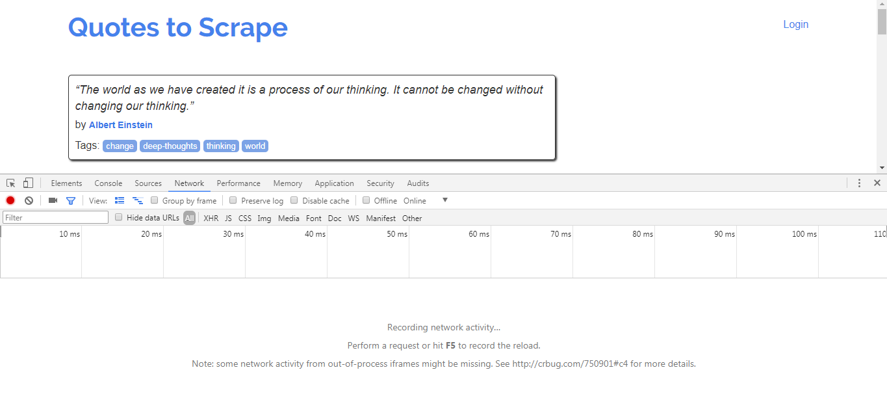
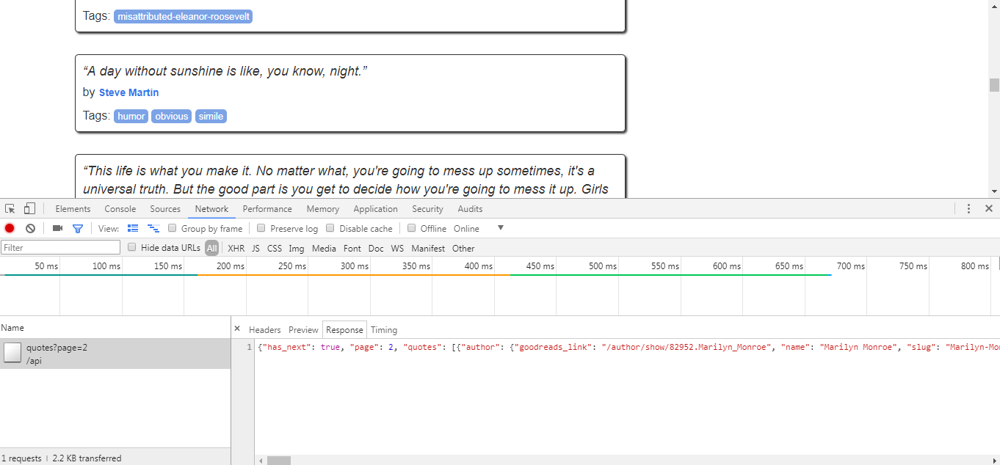
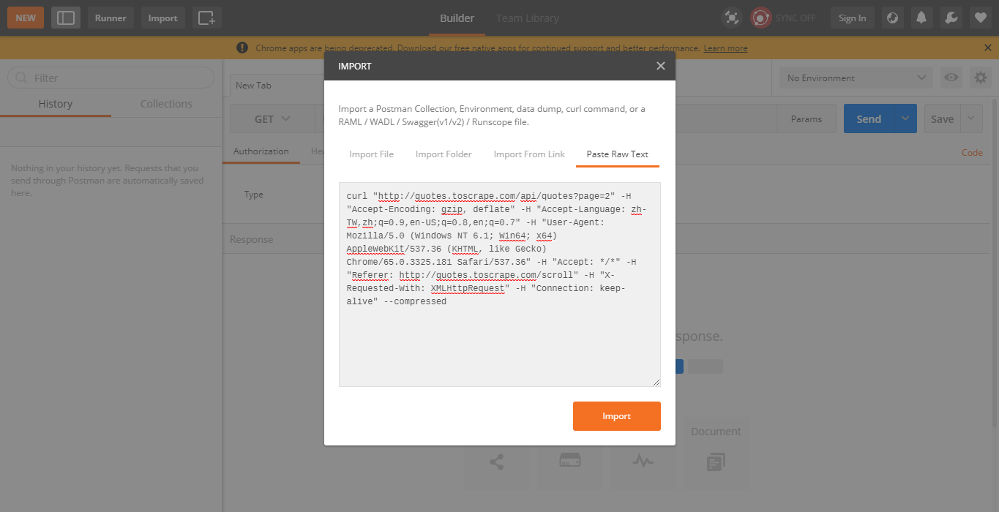
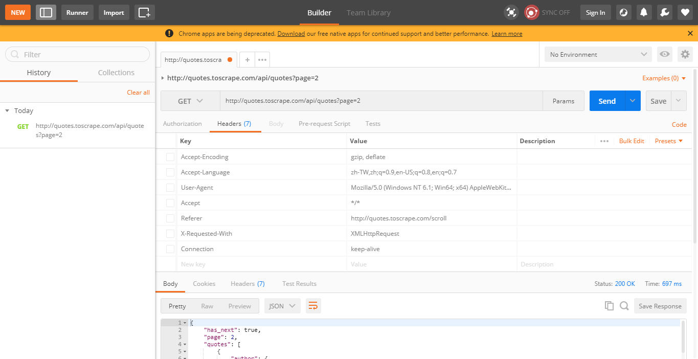

## 動態產生內容

[範例頁面](http://quotes.toscrape.com/scroll)
<br>
有時候有些內容不會隨著網頁一起丟回來，例如範例頁面就是隨著使用者頁面下滑，動態取得原本不在當前頁面的內容，這個時候我們就要尋找該網頁是如何獲取內容。<br>
方法就是利用[chapter1](chapter1.md)所介紹的各種工具。<br><br>

**一、首先把chrome dev tools開啟並切換到Network標籤**
<br><br>

**二、之後將頁面下滑，可以看到網頁多發了request，response內容也是我們要的**
<br><br>

**三、要測試這個request只要將它複製起來，對它點右鍵**
<br><br>

**四、點擊右上角的import -> Paste Raw Text，貼上它**
<br><br>

**五、可以將headers清空，執行它**
<br><br>

透過觀看下面的response可以知道只要對 http://quotes.toscrape.com/api/quotes?page=2 發送請求就可以得到想要的內容<br>
而內容為json格式，我們分析它之後可以了解它的屬性：
```bash
● has_next          是否還有下一頁
● page              現在的頁數
● quotes            目標引言位置
● quotes.text       最終目標
● 其他              不需要的資料
```
當取得這份資料之後，可以藉由has_next判斷是否還有下一頁，有下一頁就將當前page加一，再發一次下一頁(page加一)的請求，這樣持續下去就可以把全部資料撈回來。