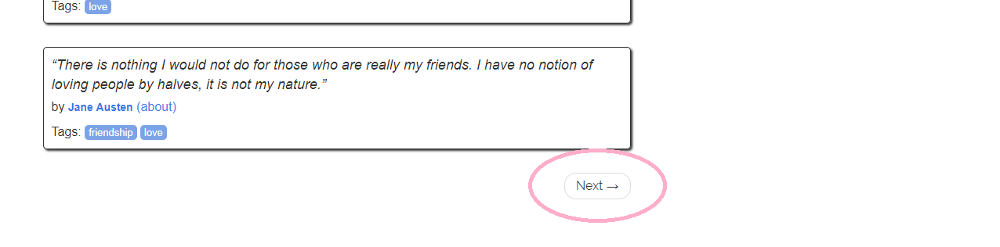

## requests 與 beautifulsoup4

[requests](http://docs.python-requests.org/en/master/)是python用來發送http請求的套件。
<br>
[beautifulsoup4](https://www.crummy.com/software/BeautifulSoup/bs4/doc/)是分析抓取回來html的套件，它也可以分析xml。
<br>

## beautifulsoup4常用語法

bs4有[四種解析器](https://www.crummy.com/software/BeautifulSoup/bs4/doc.zh/#id9)，html.parser為python內建的基本解析器<br>
將html丟給bs4分析
```python
from bs4 import BeautifulSoup
soup = BeautifulSoup((r.text), 'html.parser')
```
取得子節點
```python
soud.tag_name
```
尋找節點
```python
soud.find("tag_name")
# with class
soud.find("tag_name", class_="class_a class_b")
```
尋找大量節點
```python
soud.find_all("tag_name")
# with class
soud.find_all("tag_name", class_="class_a class_b")
```
取得節點內容
```python
tag_name.text
```
取得節點屬性
```python
tag_name['attr']
```

beautifulsoup4會將html變成節點樹，

## 開始爬蟲

**目標為抓取每一頁引言並存檔**
<br>
**目標分類：love**
<br>
**目標網址：[http://quotes.toscrape.com/tag/love/](http://quotes.toscrape.com/tag/love/)**
<br>
<br>
啟動在之前教學中所建立的虛擬環境
```bash
$ pipenv shell
```
建立python檔，檔名自取
<br>
<br>
在文件開頭表示文件編碼<br>
import 需要的套件
```python
# -*- coding: utf-8 -*-

import json
import requests
from bs4 import BeautifulSoup
```
發送http請求，取回內容並給bs4分析
```python
r = requests.get('http://quotes.toscrape.com/tag/love/')
soup = BeautifulSoup((r.text), 'html.parser')
```
取得每一筆引言的內容、作者、標籤
```python
quotes = soup.find_all("div", class_="quote")
for quote in quotes:
    q      = quote.span.text
    author = quote.find("small").text
    tags   = " ".join([a.text for a in quote.div.find_all("a")])
```
因為有下一頁的關係，所以上面的功能要變成重複利用的function

```python
def crawl_quotes(req):
    r = requests.get(req)
    soup = BeautifulSoup((r.text), 'html.parser')

    # 存引言的陣列
    quote_array = []
    quotes = soup.find_all("div", class_="quote")
    for quote in quotes:
        # 將引言、作者、標籤存成dict並丟給陣列
        obj = {}
        obj['quote']  = quote.span.text
        obj['author'] = quote.find("small").text
        obj['tags']   = " ".join([a.text for a in quote.div.find_all("a")])
        quote_array.append(obj)
```
如果有下一頁，就繼續爬，並把爬取的引言陣列通通加在一起
```python
def crawl_quotes(req):
    # 接續上面...
    if (soup.find('li', class_="next")):
        # 將這一頁陣列與下一頁的陣列相加
        quote_array = quote_array + crawl_quotes('http://quotes.toscrape.com%s' % soup.find('li', class_="next").a['href'])

    # 回傳陣列
    return quote_array
```
開始啟動function並把資料存下來
```python
crawl_data = {}
crawl_data['data'] = crawl_quotes('http://quotes.toscrape.com/tag/love/')
with open('quotes.json', 'w', encoding='utf-8') as f:
    f.write(json.dumps(crawl_data, ensure_ascii=False))
```
整體
```python
# -*- coding: utf-8 -*-

import json
import requests
from bs4 import BeautifulSoup

# 存資料的dict，用來轉成json
crawl_data = {}

# 重複利用的爬蟲
def crawl_quotes(req):
    # 發送請求並解析
    r = requests.get(req)
    soup = BeautifulSoup((r.text), 'html.parser')

    # 取得全部引言
    quotes = soup.find_all("div", class_="quote")
    # 存引言的陣列
    quote_array = []
    for quote in quotes:
        # 將引言、作者、標籤存成dict並丟給陣列
        obj = {}
        obj['quote']  = quote.span.text
        obj['author'] = quote.find("small").text
        obj['tags']   = " ".join([a.text for a in quote.div.find_all("a")])
        quote_array.append(obj)

    # 如果有下一頁
    if (soup.find('li', class_="next")):
        # 將陣列與下一頁的陣列相加
        quote_array = quote_array + crawl_quotes('http://quotes.toscrape.com%s' % soup.find('li', class_="next").a['href'])

    # 回傳陣列
    return quote_array

# 開始爬蟲
crawl_data['data'] = crawl_quotes('http://quotes.toscrape.com/tag/love/')
# 寫成json檔
with open('quotes.json', 'w', encoding='utf-8') as f:
    f.write(json.dumps(crawl_data, ensure_ascii=False))
```

RUN
```bash
$ python your_python_file.py
# 非windows系統可能要把python指令改成python3
```