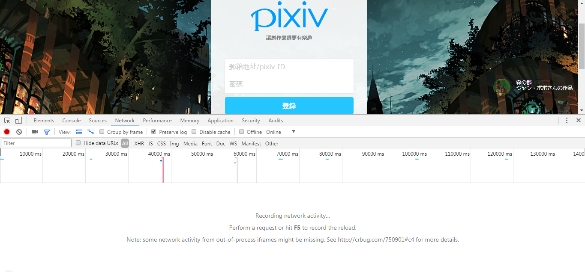
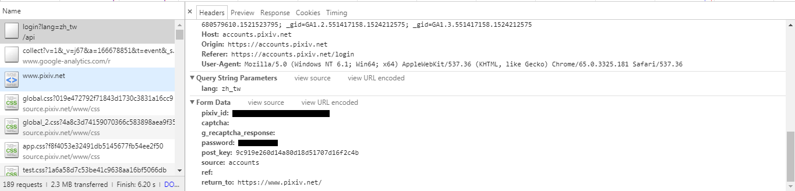
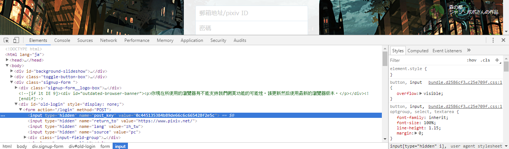
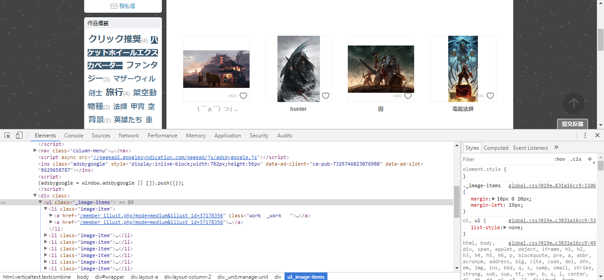
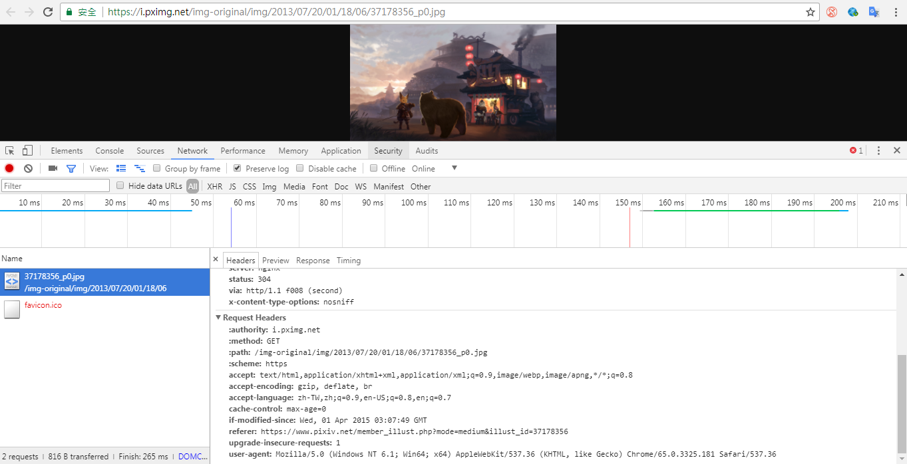

## 爬取 pixiv圖片

這邊目標為 pixiv畫廊中的單圖頁大圖<br>
所以要尋找 pixiv的登入方式<br>
會利用 scrapy登入以及下載圖片檔案<br>

<hr>

### 模擬流程

首先到[pixiv登入頁](https://accounts.pixiv.net/login)把 chrome devtools開啟，切到 Network標籤並把 Preserve log勾起來，保存跳轉頁面前的 request/response後登入

可以找到登入的 request

pixiv_id 是帳號， password 是密碼， 所以我們知道對這個網址發送一樣的 request就可以成功登入，也可以在寫程式前利用 postman測試實際上到底需要用到哪些 headers以及 Form Data，減少需要使用的參數。<br>
而 Form Data中的 post_key為登入頁當中沒有顯示出來的值，所以要先利用爬蟲取得該值才能登入

<br>進去[畫廊](https://www.pixiv.net/member_illust.php?id=366411)，取得畫廊中全部圖片網址

在圖片頁取得大圖網址 data-src屬性

取得大圖，其中header 裡的 referer 屬性是必需的，沒有會 403


<hr>

## 撰寫程式

### 創建 scrapy專案
```bash
$ scrapy startproject pixiv
$ cd pixiv
```
### 新增 spider
```
$ scrapy genspider img "pixiv.net"
```
### 修改 items<span>.py
```python
# -*- coding: utf-8 -*-

import scrapy

class PixivItem(scrapy.Item):
    # define the fields for your item here like:
    # name = scrapy.Field()
    url = scrapy.Field()         # 圖片網址
    image_paths = scrapy.Field() # 存檔後的圖片系統路徑
```

### 修改 img<span>.py

定義登入頁所需資訊
```python
class ImgSpider(scrapy.Spider):
    name = 'img'
    allowed_domains = ['pixiv.net']

    payload = {
        'pixiv_id': 'pixiv_id',
        'password': 'password',
        'source': 'pc',
        'return_to': 'https://www.pixiv.net/'
    }

```

進入登入頁
```python
def start_requests(self):
    yield scrapy.Request("https://accounts.pixiv.net/login?lang=zh_tw/", callback=self.login)
```

取得 登入頁 post_key，用 scrapy提供的方法登入([from_response](https://docs.scrapy.org/en/latest/topics/request-response.html#using-formrequest-from-response-to-simulate-a-user-login))
```python
def login(self, r):
    # 因使用 from_response所以不用自行抓取 post_key值
    # post_key = r.css('input[name=post_key]::attr(value)').extract_first()
    # self.payload['post_key'] = post_key
    yield scrapy.FormRequest.from_response(r, formdata=self.payload, callback=self.go_gallery, dont_filter = True)
```

登入後進入目標繪師畫廊
```python
def go_gallery(self, r):
    yield scrapy.Request("https://www.pixiv.net/member_illust.php?id=366411", callback=self.go_image, dont_filter = True)
```

提取每張圖片的瀏覽連結
```python
def go_image(self, r):
    head = 'https://www.pixiv.net'
    li = r.css('li.image-item a::attr(href)').extract()
    for url in li:
        yield scrapy.Request(head + url, callback=self.extract_url, dont_filter = True)
```

在每張圖片當中提取大圖網址，存到 Item丟給 ImagesPipeline下載
```python
from pixiv.items import PixivItem

def extract_url(self, r):
    src = r.css('img.original-image::attr(data-src)').extract()
    item = PixivItem()

    for url in src:
        item['url'] = url
        yield item
```

img<span>.py 整體
```python
# -*- coding: utf-8 -*-
import scrapy
from pixiv.items import PixivItem

class ImgSpider(scrapy.Spider):
    name = 'img'
    allowed_domains = ['pixiv.net']

    payload = {
        'pixiv_id': 'pixiv_id',
        'password': 'password',
        'source': 'pc',
        'return_to': 'https://www.pixiv.net/'
    }

    # 進入登入頁
    def start_requests(self):
        yield scrapy.Request("https://accounts.pixiv.net/login?lang=zh_tw/", callback=self.login)

    # 登入
    def login(self, r):
        # post_key = r.css('input[name=post_key]::attr(value)').extract_first()
        # self.payload['post_key'] = post_key
        yield scrapy.FormRequest.from_response(r, formdata=self.payload, callback=self.go_gallery, dont_filter = True)

    # 登入後到畫廊
    def go_gallery(self, r):
        yield scrapy.Request("https://www.pixiv.net/member_illust.php?id=366411", callback=self.go_image, dont_filter = True)

    # 去每張圖片的頁面
    def go_image(self, r):
        head = 'https://www.pixiv.net'
        li = r.css('li.image-item a::attr(href)').extract()
        for url in li:
            yield scrapy.Request(head + url, callback=self.extract_url, dont_filter = True)

    # 提取大圖網址並丟給 pipelines處理
    def extract_url(self, r):
        src = r.css('img.original-image::attr(data-src)').extract()
        item = PixivItem()

        for url in src:
            item['url'] = url
            yield item
```

### 修改 pipelines<span>.py

scrapy 除了提供普通的 pipelines外還提供了[檔案、圖片下載的pipelines](https://docs.scrapy.org/en/latest/topics/media-pipeline.html)<br><br>

我們可以不用撰寫任何程式，只要按照文件裡的到 Setting裡啟用它提供的 pipelines，提供檔案存儲地點，以及填上它規定的 items欄位名就好。<br><br>

而以下範例程式和填的 item都是客製化的圖片 pipeline，覆寫預設的 pipeline 設定<br><br>

pipelines整體，在 pipelines<span>.py 新增一個 class(也可以刪除原本的 class，修改原本的 class，或是新增檔案後再寫一個 class)
```python
# -*- coding: utf-8 -*-

import scrapy                                               # 引入 scrapy
from scrapy.pipelines.images import ImagesPipeline          # 引入 scrapy 的內建圖片 pipeline
from scrapy.exceptions import DropItem                      # 引入丟掉 item的方法

class PixivImagesPipeline(ImagesPipeline):                  # 繼承引入的 ImagesPipeline
# 覆寫三個 function()

    # 回傳檔案路徑+檔名
    def file_path(self, request, response=None, info=None):
        # 將圖片網址切出檔名那一段，預設會將網址轉成 sha1亂數並回傳
        image_guid = request.url.split('/')[-1]
        return '%s' % (image_guid)

    # 回傳圖片網址(一個 request)，只要回傳就會自己下載，並依照 file_path()傳回的路徑存檔
    def get_media_requests(self, item, info):
        # 沒有 referer會403
        yield scrapy.Request(item['url'], headers={'referer': item['url']}, dont_filter = True)

    # 存完圖片後會呼叫，預設會將圖片路徑丟到 item，下一個 pipeline 就會有圖片路徑
    # 這邊沒有改變預設的程式碼
    def item_completed(self, results, item, info):
        image_paths = [x['path'] for ok, x in results if ok]
        if not image_paths:
            raise DropItem("Item contains no images")
        item['image_paths'] = image_paths
        return item
```

### 修改 settings<span>.py

```python
# 不用 robots.txt
ROBOTSTXT_OBEY = False
# 修改 Headers
DEFAULT_REQUEST_HEADERS = {
  'User-Agent': 'Mozilla/5.0 (Windows NT 6.1; Win64; x64) AppleWebKit/537.36 (KHTML, like Gecko) Chrome/65.0.3325.162 Safari/537.36'
}
# 間隔 3秒
DOWNLOAD_DELAY = 3
# 將預設的改成寫完的圖片 pipelines
ITEM_PIPELINES = {
   # 'pixiv.pipelines.PixivPipeline': 300,
   'pixiv.pipelines.PixivImagesPipeline': 300,
}
# 設定圖片存儲地點
IMAGES_STORE = 'images'
```

### 爬圖片

撰寫時是寫相對路徑 所以在哪爬資料夾就在哪
```bash
$ scrapy crawl img
```

### 管理 Cookies

[Cookies 設定](https://docs.scrapy.org/en/latest/topics/downloader-middleware.html#std:setting-COOKIES_ENABLED)<br>
[Cookies 中介層](https://docs.scrapy.org/en/latest/topics/downloader-middleware.html#module-scrapy.downloadermiddlewares.cookies)<br>
scrapy 預設會自動啟用 Cookie，所以我們不需要寫任何東西，在剛剛的 pixiv登入後就可以暢行無阻需要登入的頁面
